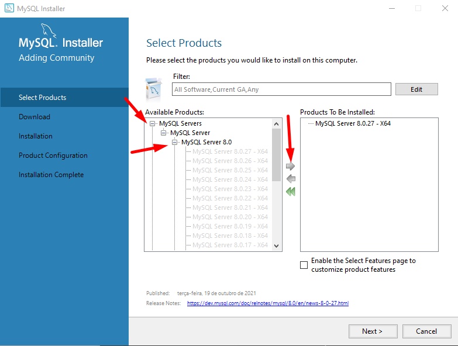
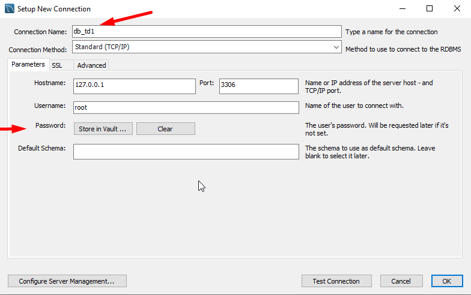
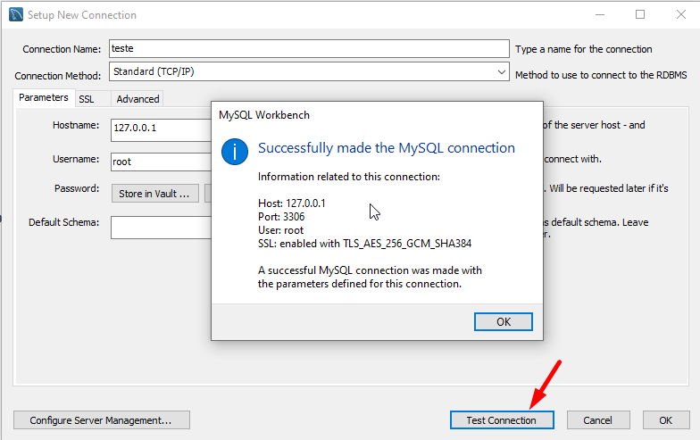
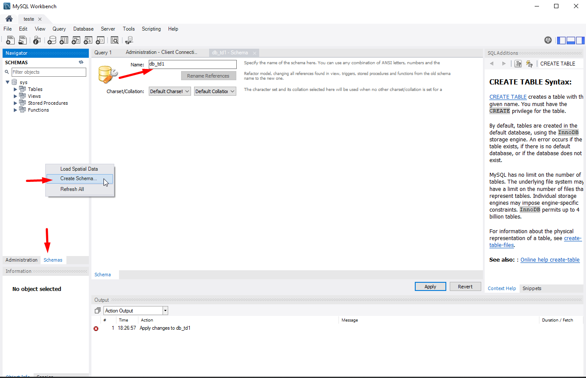

# TakManager


## Tecnologias utilizadas:

* Handlebars
* CSS3
* MySql
* Express


## Como Inicializar:
Aqui você encontra o passo a passo para reproduzir essa aplicação em seu computador!

### Configurando o MyQsl Server:
Primeiramente, este projeto utiliza do banco de dados do mysql, então vamos configura-lo.

* Baixe o servidor do mysql [Neste link](https://dev.mysql.com/downloads/mysql/)
* Não é necessário fazer o login, apenas clique em ``No thanks, just start my download.``
* Baixe a versão que deseja do mysql server:
    
* Memorize a senha colocada durante a instalação, vocÊ precisará dela para a aplicação!
* Deixe todas as configurações padrões.
---
* Baixe o mysql workbench [neste link](https://dev.mysql.com/get/Downloads/MySQLGUITools/mysql-workbench-community-8.0.27-winx64.msi) e depois instale;
* Inicie uma conexão no seu mysql server
    
* Observe os nomes, a porta, o ip, e a senha para poder coloca-las no arquivo ``.env``
* Clique para testar sua conecção, se você instalou tudo, setou as senhas e os nomes corretamente, isso aparecerá:
    
* clique e abra sua conexão.
* Crie o schema do banco de dados:
    
* Apos criar, configure as variaveis de ambiente!
---

### Configurando as variaveis de ambiente (.env)

* primeiramente, crie na raiz do projeto um arquivo com o nome ``.env``
* coloque suas variaveis de acordo com o que você necessita:
    ```env
    DATABASE_SCHEMA_NAME="nomeDoSchema"
    DATABASE_USER_PASSWORD="senha"
    DATABASE_PORT="3306"

    PORT="5800"
    ```
* Lembre-se de criar na raiz do projeto!

### Iniciando os comandos:

* Certifique-se que tenha instalado um gerenciador de pacotes, como npm ou yarn, nesse exemplo utilizarei o yarn.
* ``yarn install`` - instala todas as dependencias do projeto
* ``yarn sync`` - quando com o servidor do myqsl aberto e com as variaveis corretamente configuradas, um log deve aparecer similar a este:
    ```sql
    Executing (default): CREATE TABLE IF NOT EXISTS `tasks` (`id` INTEGER NOT NULL auto_increment , `title` VARCHAR(50), `description` VARCHAR(300), `data` VARCHAR(15), `hour` VARCHAR(10), `email` VARCHAR(100), `phone` VARCHAR(15), `password` VARCHAR(50), `createdAt` DATETIME NOT NULL, `updatedAt` DATETIME NOT NULL, PRIMARY KEY (`id`)) ENGINE=InnoDB;Executing (default): SHOW INDEX FROM `tasks`
    ```
* ``yarn dev`` - executa a aplicação


